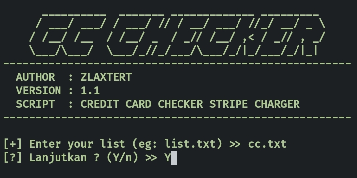

# cc-checkerV1
Credit Card Checker Stripe Charger 

## Install on desktop : 
- Install XAMPP
- Added environment variable system path => C:\xampp\php
- download the script and save it in your folder
- open CMD and running

## Install on android (Termux)
    $ apt-get update && apt-get upgrade
    $ pkg install git -y
    $ pkg install php -y
    $ git clone https://github.com/B4D1A/cc-checker-php
    $ cd cc-checker-php
    $ php cc.php
## Install on Linux 
    $ sudo apt-get update && apt-get upgrade
    $ sudo apt install git -y
    $ sudo apt install php -y
    $ sudo git clone https://github.com/B4D1A/cc-checker-php
    $ cd cc-checker-php
    $ php cc.php
## Screenshot

